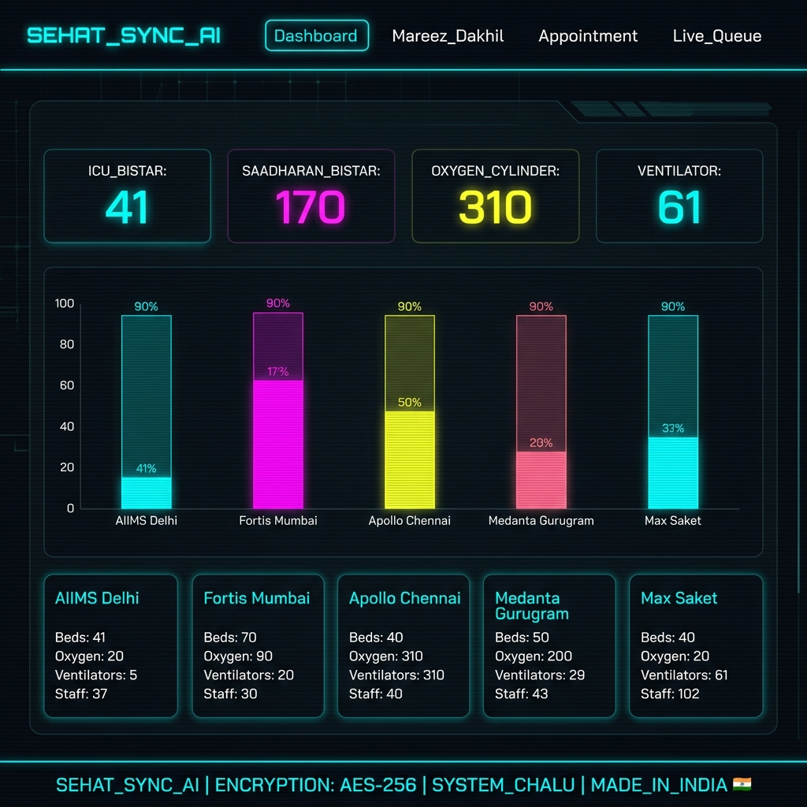
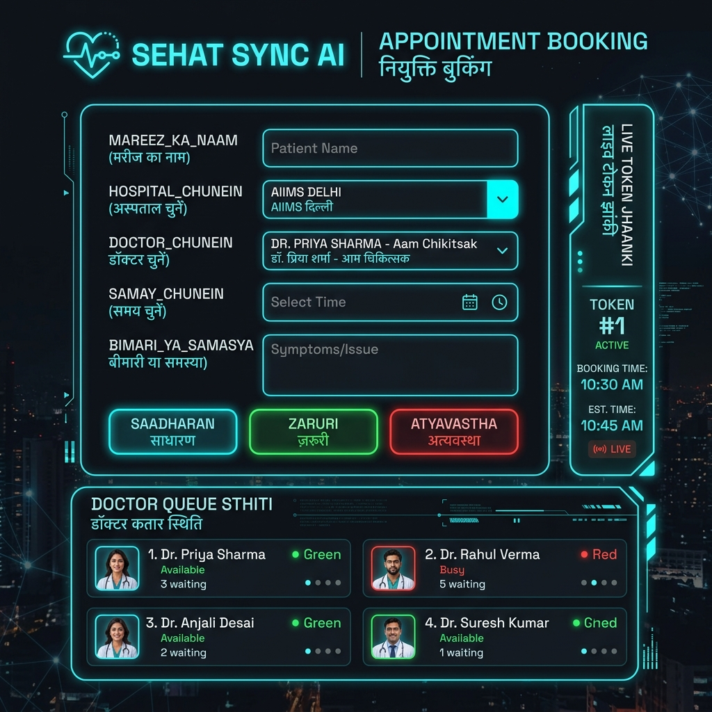
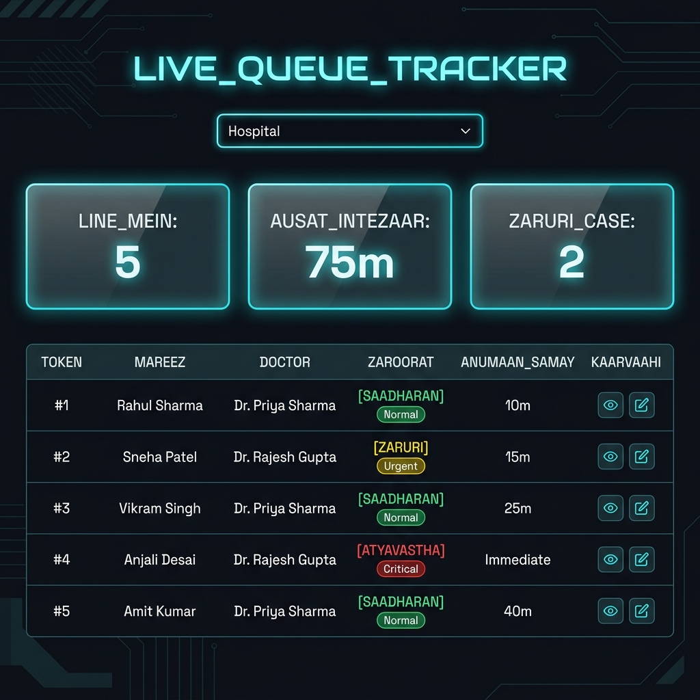

<p align="center">
  
  
  
</p>

<h1 align="center">⚡ SEHAT SYNC AI ⚡</h1>
<h3 align="center">🇮🇳 Bharat Ka Apna AI-Powered Smart Hospital System 🇮🇳</h3>

<p align="center">
  <b>Real-time hospital resource monitoring + Smart appointment booking + AI-driven patient allocation</b>
  <br/>
  <em>Jaise train ticket booking — waise hospital token booking! 🚆</em>
</p>

---

## 📸 Screenshots

### 🖥️ Dashboard — Hospital Sansadhan Overview
Real-time mein sabhi hospitals ke ICU bistar, saadharan bistar, oxygen cylinder aur ventilator ka status dekhein.



### 📅 Smart Appointment Booking — Token System
Doctor chunein, samay chunein — turant token number aur anumaan samay mil jayega. Bilkul train ticket jaisa!



### 📊 Live Queue Tracker — Real-Time Monitoring
Sabhi mareez ka live queue status, doctor wise tracking, aur priority-based sorting.



---

## 🌟 Kya Hai Sehat Sync AI?

**Sehat Sync AI** ek AI-powered smart hospital management system hai jo Bharat ke top hospitals (AIIMS, Fortis, Apollo, Medanta, Max) ke liye banaya gaya hai. Yeh system hospital resources ko real-time mein monitor karta hai, AI se mareez ki priority decide karta hai, aur smart token system se appointment booking karta hai.

### 🎯 Mukhya Features

| Feature | Vivaran |
|---------|---------|
| 🏥 **Real-Time Dashboard** | Sabhi hospitals ke ICU bistar, oxygen, ventilator ka live status |
| 🤖 **AI Priority Scoring** | AI engine automatically mareez ki gambhirta score karta hai |
| 🎫 **Smart Token System** | Train ticket booking jaisa — token number + anumaan samay |
| 📊 **Live Queue Tracker** | Real-time mein doctor-wise queue monitoring |
| 🔔 **Socket.io Alerts** | Turant notification jab resource critical ho |
| 📱 **Responsive Design** | Mobile, tablet aur desktop par kaam kare |
| 🌙 **Neon Cyberpunk UI** | Dark techy theme with cyan neon accents |

---

## 🏗️ Tech Stack

### Frontend (Client)
| Technology | Kaam |
|-----------|------|
| **React 18** + Vite | Fast SPA framework |
| **Tailwind CSS** | Utility-first CSS styling |
| **Chart.js** | Hospital data ke charts |
| **Socket.io Client** | Real-time updates |
| **React Router v6** | Page navigation |
| **Space Grotesk + Inter** | Premium typography |

### Backend (Server)
| Technology | Kaam |
|-----------|------|
| **Node.js** + Express | REST API server |
| **MongoDB** (Memory Server) | Database for hospitals & patients |
| **Mongoose** | MongoDB ODM |
| **Socket.io** | Real-time communication |
| **CORS** | Cross-origin requests |

### AI/ML Engine
| Technology | Kaam |
|-----------|------|
| **Python FastAPI** | ML microservice |
| **scikit-learn** | Priority scoring model |
| **NumPy/Pandas** | Data processing |

---

## 📁 Project Structure

```
SEHAT-SYNC-AI/
├── 📂 client/                     # Frontend (React + Vite)
│   ├── 📂 src/
│   │   ├── 📂 components/
│   │   │   ├── Dashboard.jsx      # Hospital sansadhan overview
│   │   │   ├── PatientForm.jsx    # Mareez dakhila form
│   │   │   ├── AppointmentBooking.jsx  # Smart token booking
│   │   │   └── LiveQueueTracker.jsx    # Real-time queue
│   │   ├── App.jsx                # Main app with routing
│   │   ├── index.css              # Neon MedTech design system
│   │   └── main.jsx               # Entry point
│   ├── index.html                 # HTML template
│   ├── package.json
│   ├── tailwind.config.js
│   └── vite.config.js
├── 📂 server/                     # Backend (Node.js + Express)
│   ├── 📂 models/
│   │   ├── Hospital.js            # Hospital schema
│   │   ├── Patient.js             # Patient schema
│   │   └── Appointment.js         # Appointment schema
│   ├── 📂 routes/
│   │   └── api.js                 # All API endpoints
│   ├── index.js                   # Server entry + Socket.io
│   └── seed.js                    # Indian hospitals seed data
├── 📂 ml-service/                 # AI/ML Engine (Python)
│   ├── main.py                    # FastAPI ML endpoints
│   └── requirements.txt
├── 📂 screenshots/                # App screenshots
│   ├── dashboard.png
│   ├── booking.png
│   └── queue.png
└── README.md                      # Yeh file 📄
```

---

## 🏥 Indian Hospitals Data

System mein yeh 5 major Indian hospitals configured hain:

| Hospital | Shehar | ICU | General | O2 | Ventilator | Ambulance |
|----------|--------|-----|---------|-----|-----------|-----------|
| **AIIMS Delhi** | Nai Dilli | 12 | 50 | 80 | 18 | 8 |
| **Fortis Mumbai** | Mumbai | 8 | 35 | 60 | 12 | 6 |
| **Apollo Chennai** | Chennai | 10 | 40 | 70 | 15 | 7 |
| **Medanta Gurugram** | Gurugram | 6 | 25 | 55 | 8 | 5 |
| **Max Saket** | Nai Dilli | 5 | 20 | 45 | 8 | 4 |

## 👨‍⚕️ Doctors Panel

| Doctor | Visheshagyta | Icon |
|--------|-------------|------|
| **Dr. Priya Sharma** | Aam Chikitsak (General Physician) | 🩺 |
| **Dr. Rajesh Gupta** | Hriday Rog Visheshagya (Cardiologist) | ❤️ |
| **Dr. Anjali Mehta** | Naadi Tantrika Visheshagya (Neurologist) | 🧠 |
| **Dr. Vikram Patel** | Bachho Ke Doctor (Pediatrician) | 👶 |

---

## 🚀 Setup & Installation

### Prerequisites
- **Node.js** v18+
- **Python** 3.9+
- **npm** ya **yarn**

### Step 1: Repository Clone Karein
```bash
git clone https://github.com/sahil24raj/MedAlloc-AI-24.git
cd MedAlloc-AI-24
```

### Step 2: Backend Setup
```bash
cd server
npm install
node index.js
```
> Server `http://localhost:5000` pe chalega

### Step 3: Frontend Setup
```bash
cd client
npm install
npm run dev
```
> Client `http://localhost:5173` pe chalega

### Step 4: ML Service (Optional)
```bash
cd ml-service
pip install -r requirements.txt
uvicorn main:app --reload --port 8000
```
> ML Service `http://localhost:8000` pe chalega

---

## 🔌 API Endpoints

### Hospitals
| Method | Endpoint | Kaam |
|--------|----------|------|
| `GET` | `/api/hospitals` | Sabhi hospitals ki list |
| `PUT` | `/api/hospitals/:id/resources` | Hospital resources update karein |

### Patients (Mareez)
| Method | Endpoint | Kaam |
|--------|----------|------|
| `GET` | `/api/patients` | Sabhi mareez ki list |
| `POST` | `/api/patients` | Naya mareez register karein |

### Appointments
| Method | Endpoint | Kaam |
|--------|----------|------|
| `GET` | `/api/appointments/queue/:hospital_id` | Hospital ki live queue |
| `GET` | `/api/appointments/doctor-slots/:hospital_id` | Doctor-wise slot status |
| `POST` | `/api/appointments` | Naya appointment book karein |
| `POST` | `/api/appointments/estimate` | Token & samay ka anumaan |
| `PUT` | `/api/appointments/:id/status` | Appointment status update |

---

## 🎨 Design System — Neon MedTech

### Color Palette
| Naam | Hex Code | Kaam |
|------|----------|------|
| **Background** | `#111318` | Main dark background |
| **Neon Cyan** | `#00dbe9` | Primary accent, links, highlights |
| **Neon Lime** | `#bcff5f` | Success, availability, AI features |
| **Neon Pink** | `#ffb4ab` | Danger, emergency, high priority |
| **Blue Mist** | `#aec6ff` | Secondary info, ventilator stats |
| **Dark Surface** | `#1e2024` | Card backgrounds, panels |
| **Text Dim** | `#849495` | Secondary text, labels |
| **Border Dark** | `#3b494b` | Borders, dividers |

### Typography
- **Headings**: Space Grotesk (Bold 700)
- **Body**: Inter (Regular 400 / Semi-Bold 600)
- **Labels**: Space Grotesk (Bold 700, UPPERCASE, letter-spacing 0.1em)

### UI Components
- **Glass Panels**: `backdrop-filter: blur(16px)` with neon borders
- **Neon Buttons**: Cyan glow shadow `0 0 20px rgba(0,219,233,0.3)`
- **Scanline Effect**: Animated horizontal line overlay
- **Tech Grid**: Repeating dot pattern background
- **Ticket Card**: Dashed border divider (jaisa railway ticket)

---

## 🎫 Smart Token System — Kaise Kaam Karta Hai?

```
1️⃣ Mareez HOSPITAL aur DOCTOR chunte hain
2️⃣ Preferred SAMAY select karte hain
3️⃣ AI engine LIVE QUEUE analyze karta hai
4️⃣ System TOKEN NUMBER generate karta hai
5️⃣ ANUMAAN SAMAY batata hai — "Aapka number ~10:30 tak aayega"
6️⃣ AI RECOMMENDATION deta hai — "Agar 9:00 baje aayein toh kam wait hoga"
```

Bilkul IRCTC train booking jaisa experience! 🚆

---

## ⚡ Socket.io Real-Time Events

| Event | Direction | Kaam |
|-------|----------|------|
| `resource_update` | Server → Client | Jab hospital resources change ho |
| `new_patient` | Server → Client | Jab naya mareez register ho |
| `appointment_new` | Server → Client | Jab nayi booking ho |
| `appointment_update` | Server → Client | Jab appointment status change ho |
| `alert` | Server → Client | Emergency notifications |

---

## 🤖 AI Priority Scoring Algorithm

```
Priority Score = (Severity × 0.4) + (Age Factor × 0.2) + 
                 (Oxygen Factor × 0.25) + (Comorbidity × 0.15)

Jahan:
  - Severity: 0-100 (Mareez ki gambhirta)
  - Age Factor: Bachche (<12) aur Buzurg (>60) ko zyada score
  - Oxygen Factor: SpO2 < 90% = Critical
  - Comorbidity: Purani bimari ka star (0, 1, 2)

Result:
  - Score > 70 → 🔴 ZYADA ZARURI (High Priority)
  - Score 40-70 → 🟡 THODA ZARURI (Medium)
  - Score < 40 → 🟢 SAADHARAN (Low)
```

---

## 🌐 Environment Variables

### Client (`client/.env`)
```env
VITE_API_URL=http://localhost:5000
```

### Server (`server/.env`)
```env
PORT=5000
MONGODB_URI=mongodb://localhost:27017/sehat-sync-ai
ML_SERVICE_URL=http://localhost:8000
```

---

## 📋 Aage Kya Banana Hai? (Roadmap)

- [ ] 🔐 JWT Authentication — Login/Signup system
- [ ] 📱 WhatsApp/SMS Notifications via Twilio
- [ ] 🗺️ Google Maps Integration — Nearest hospital
- [ ] 💳 Online Payment Gateway (Razorpay)
- [ ] 📊 Advanced Analytics Dashboard
- [ ] 🏥 MongoDB Atlas pe migrate (production)
- [ ] 🌐 Multi-language support (Hindi, Tamil, Bengali)
- [ ] 📄 PDF Token/Receipt generation

---

## 🤝 Contribute Kaise Karein?

1. **Fork** karein yeh repo
2. Apna **branch** banayein (`git checkout -b feature/naya-feature`)
3. Changes **commit** karein (`git commit -m 'feat: naya feature add kiya'`)
4. Branch pe **push** karein (`git push origin feature/naya-feature`)
5. **Pull Request** kholein

---

## 👨‍💻 Developers

| Developer | Role |
|-----------|------|
| **Sahil Raj** | Full-Stack Developer & AI Engineer |

---

## 📜 License

Yeh project **MIT License** ke under hai. Matlab aap ise freely use, modify aur distribute kar sakte hain.

---

<p align="center">
  <b>⚡ SEHAT_SYNC_AI — SMART HOSPITAL SYSTEM — BHARAT 🇮🇳 ⚡</b>
  <br/>
  <em>Made with ❤️ in India | Powered by AI</em>
  <br/><br/>
  
  
</p>
